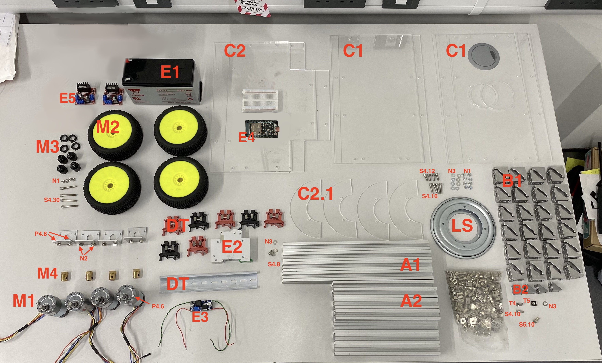

# Building the OpenScout robot with 'lazy Susan' revolute hinge
This configuration uses four-wheel differential drive steering, and a Lazy Susan hinged body which enables the wheels to drive over small obstacles without the need for suspension.

## Total Build time = 390 minutes (6 hours 30 minutes)

This section is a summary of parts needed to build the OpenScoutV1.1. For a detailed description of each part see [here](./detailed_part_inventory.md). Please note that some of these links use an amazon link shortener which seemingly has occasional brief outages, if they don't work try again a bit later.

## Assembly Tools Required
These are the tools required.

| Material                         | Quantity | UK link |Availability|
| ---------------------------------|---------:|:-------:|:----------:|
| M2/3/4/5 Hex Key | 1 | [Link](https://www.amazon.co.uk/ZISHATUO-Hex-Key-Set-2mm-5mm/dp/B09H768WYX/ref=pb_allspark_dp_sims_pao_desktop_session_based_sccl_2/258-5239920-8165609?pd_rd_w=kzaV3&pf_rd_p=0b4a59e4-200b-45ea-a783-524e7e41dc2f&pf_rd_r=RD0QHGDWYM9XFNKMBHKS&pd_rd_r=8dc6d3ba-93f0-4fe6-a26c-0d9a4fdacbea&pd_rd_wg=EEpUo&pd_rd_i=B09H768WYX&psc=1) | Mediocre |
| Small Flathead Screwdriver | 1 | [Link](https://www.amazon.co.uk/Rolson-28852-Screwdriver-Set-Pieces/dp/B00OOTPM6K/ref=sr_1_21?crid=BQBSM3K5OGBA&keywords=small%2BPhil%3Blips%2Bhead%2Bscrewdriver&qid=1649287786&s=diy&sprefix=small%2Bphil%2Blips%2Bhead%2Bscrewdriver%2Cdiy%2C107&sr=1-21&th=1) | Good |
| Small Phillips Head Screwdriver | 1 | [Link](https://www.amazon.co.uk/Rolson-28852-Screwdriver-Set-Pieces/dp/B00OOTPM6K/ref=sr_1_21?crid=BQBSM3K5OGBA&keywords=small%2BPhil%3Blips%2Bhead%2Bscrewdriver&qid=1649287786&s=diy&sprefix=small%2Bphil%2Blips%2Bhead%2Bscrewdriver%2Cdiy%2C107&sr=1-21&th=1) | Good |
| 100mm Steel rule | 1 | [Link](https://www.amazon.co.uk/Silverline-MT65-Steel-Rule-150/dp/B000LFXRNQ/ref=sr_1_5?crid=3H7ZUITKEPZYU&keywords=100mm+metal+ruler&qid=1649287876&s=diy&sprefix=100mm+metal+rule%2Cdiy%2C128&sr=1-5) | Good |

## Bill of materials
Before proceeding make sure you do have all the following materials. You are encouraged to read carefully the tutorial before starting building the robot.

For the chassis:
| Material                         | Quantity | Reference | UK link |Availability|
| ---------------------------------|---------:|:---------:|:-------:|:----------:|
| 300mm 20x20 aluminium extrusion  | 8 |  A1 | [Link](https://ooznest.co.uk/product/v-slot-linear-rail-20x20mm-cut-to-size/) | Good |
| 200mm 20x20 aluminium extrusion  | 17 | A2 | [Link](https://ooznest.co.uk/product/v-slot-linear-rail-20x20mm-cut-to-size/) | Good |
| 20x20 Angle Joint Brace Brackets | 48 | B1 | [Link](https://amz.run/5TF6) | Good |
| 90 Degree Cast Corner | 8 | B2 | [Link](https://ooznest.co.uk/product/90-degree-cast-corner/) | Good |
| 200x340x3mm acrylic sheets | 4 | C1 | [Link](https://www.acrylicsheetcuttosize.co.uk/product/clear-acrylic-sheet/) | Good |
| 240x340x3mm acrylic sheets | 2 | C2 | [Link](https://www.acrylicsheetcuttosize.co.uk/product/clear-acrylic-sheet/) | Good |
| Lazy Susan 5.5in | 1 | LS | [Link](https://aliexpi.com/ue6m) | Aliexpress |
| Din rail with terminal blocks | 1 | DT | [Link](https://amz.run/5TFF) | Mediocre |
| Velcro 50mmx1m | 1 | Q | [Link](https://amz.run/5TFP) | Bad |
| 90:1 12V motor with encoders | 4 | M1 | [Link](https://amz.run/5TFQ) | Good |
| Wheels (112x46mm) | 4 | M2 | [Link](https://www.ubuy.co.na/product/4Z24S4Z98-kingval-4pcs-replacement-durable-rc-tyre-tire-wheel-112x46mm-hex-joint-17mm-compatible-with-1-8-off-road-car-buggy-redcat-team-losi-vrx-hpi) | Bad |
| Wheel Hex Driver 12mm to 17mm | 4 | M3 | [Link](https://amz.run/9w94) | Mediocre |
| Hex coupler 6mm   | 4 | M4 | [Link](https://amz.run/5TFT) | Bad |

For the electronics:
| Material                         | Quantity | Reference | UK link |Availability|
| ---------------------------------|---------:|:---------:|:-------:|:----------:|
| 12V Lead Acid battery | 1 | E1 | [Link](https://uk.rs-online.com/web/p/lead-acid-batteries/0597835) | Good |
| 10A circuit breaker | 1 | E2 | [Link](https://amz.run/5TFI) | Good |
| Buck converter | 1 | E3 | [Link](https://amz.run/5TFJ) | Good |
| ESP32 | 1 | E4 | [Link](https://amz.run/9w90) | Good |
| L298N Motor drivers | 2 | E5 | [Link](https://amz.run/5TFN) | Good |
| Breadboards | - | - | - | Good |
| Wires | - | - | - | Good |

Bolts & nuts:
| Material                         | Quantity | Reference | UK link |Availability|
| ---------------------------------|---------:|:---------:|:-------:|:----------:|
| Sems screw 6mm (More info needed) | 16 | P4.6 | - |Assumed Good|
| Sems screw 8mm (More info needed) | 8 | P4.8 | - |Assumed Good|
| M4 8mm socket screw | 2 | S4.8 | - |Assumed Good|
| M4 10mm socket screw | 8 | S4.10 | - |Assumed Good|
| M4 12mm socket screw (More info needed) | 4 | S4.12 | - |Assumed Good|
| M4 16mm socket screw (More info needed) | 4 | S4.16  | - |Assumed Good|
| M4 30mm socket screw | 4 | S4.30 | - |Assumed Good|
| M5 10mm socket screw | 144 | S5.10 | - |Assumed Good|
| M4 T-slot nuts | 10 | T4 | - |Assumed Good|
| M5 T-slot nuts | 144 | T5 | - |Assumed Good|
| M4 Hex nuts | 12 | N1 | - |Assumed Good|
| M4 Hammer nuts (More info needed)| 8 | N2 | - |Assumed Good|
| M5 Washers | 170 | N3 | - |Assumed Good|

  

(**NOTE**: The links are provided only as examples and there is no affiliation with the suppliers. The reader is advised to look for cheaper alternatives if possible, for example ESP32s cost a few USD on aliexpress. The motor brackets are provided in the CQRobot motor package, thus they are not in the bill of materials. Please keep in mind that alternative motors, brackets or components might require different bolts or additional parts.)

## Reviewer note - Known Issues

These need to be addressed.

- The specific wheel used has fallen out of production (as of writing its still possible to aquire it through an unusual website)
- The original adaptor associated with the wheel is in 3rd party production.
- Hinge seems to be available from aliexpress still, but it going out of production should be planned for just in case
- The specific terminal blocks from the given link have spotty availabilty

Temporary suggestions before a solution is chosen:
- Connecting and splitting wire connections with push connectors instead of the defunct din rail terminal.
- Instead of using the 12mm to 17mm hex adaptor, stack multiple washers on the outside of the wheel until the screw isn't loose.

Also, the descriptions of each component are not sufficient.
- What if a link dies or a storepage closes?
- How would someone in the future know how to source a replacement part.
- I recommend detailing and documenting every part [here](./detailed_part_inventory.md), including any plans such as potential 3D printing or local manufacturing blueprint.

In the amended design, measures should be taken to secure future buildability (such as using simpler components, or using 3D printing)

## Assembly instructions.

Pick either route A or route B.

Route A uses real pictures and text instructions, route B follows ikea/lego styled build instructions for the chassis.

_For advanced users who made significant changes to the robot, follow PID calibration at the end._

## Route A
This tutorial consists of 8 parts for constructing the robot platform with the hinge in the middle. It is necessary to be followed in the given order. After finishing the assembly, the robot is ready to be flashed with firmware!

1. [Front compartment](./front_compartment.md)
2. [Back compartment](./back_compartment.md)
3. [Connecting the two compartments with the hinge](./hinge.md)
4. [Adding the acrylic panels](./acrylic_panels.md)
5. [Din rail](./din_rail.md)
6. [Attaching the motors and the wheels](./motors_and_wheels.md)
7. [Adding the electronics](./circuit_assembly_instructions.md)
8. [Add the controller software](../../Software/Controller/README.md)

## Route B

This route begins uses the PDF assembly instructions instead, but after finishing the electronics installation instructions have to be followed afterwards.

Tip: GitHub doesn't load all pages by default, so it may be helpful to download the PDF.

1. [Printable Assembly Manual (PDF)](../../Documentation/CAD_Files/Instruction_Manual/InstructionManual.pdf)
2. [Din rail](./din_rail.md)
3. [Adding the electronics](./circuit_assembly_instructions.md)
4. [Add the controller software](../../Software/Controller/README.md)

## PID controller calibration (Advanced users)

This step is only neccesary if you made significant adjustments to the OpenScout (e.g. length changes)

[PID controller calibration](./pid_calibration.md)

Page last reviewed by: B.K. on 18/07/25
