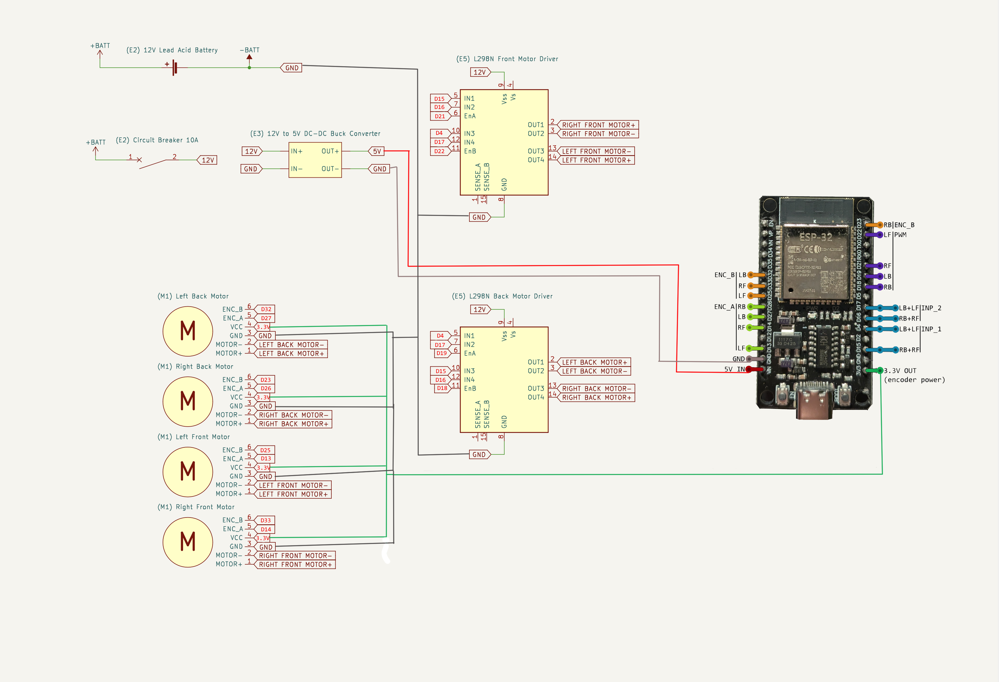
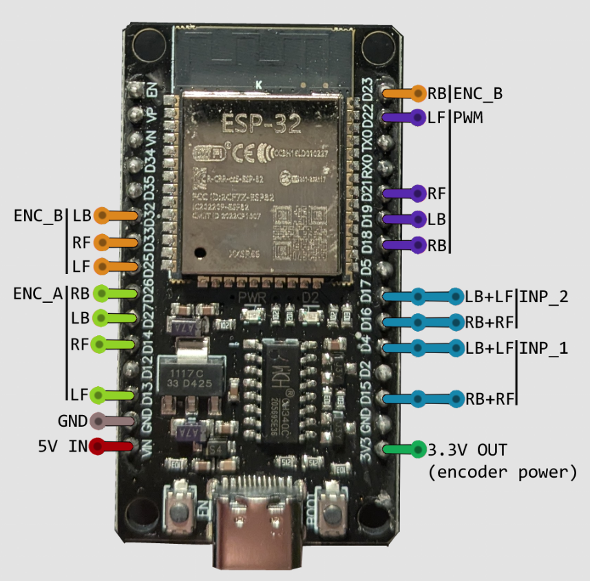
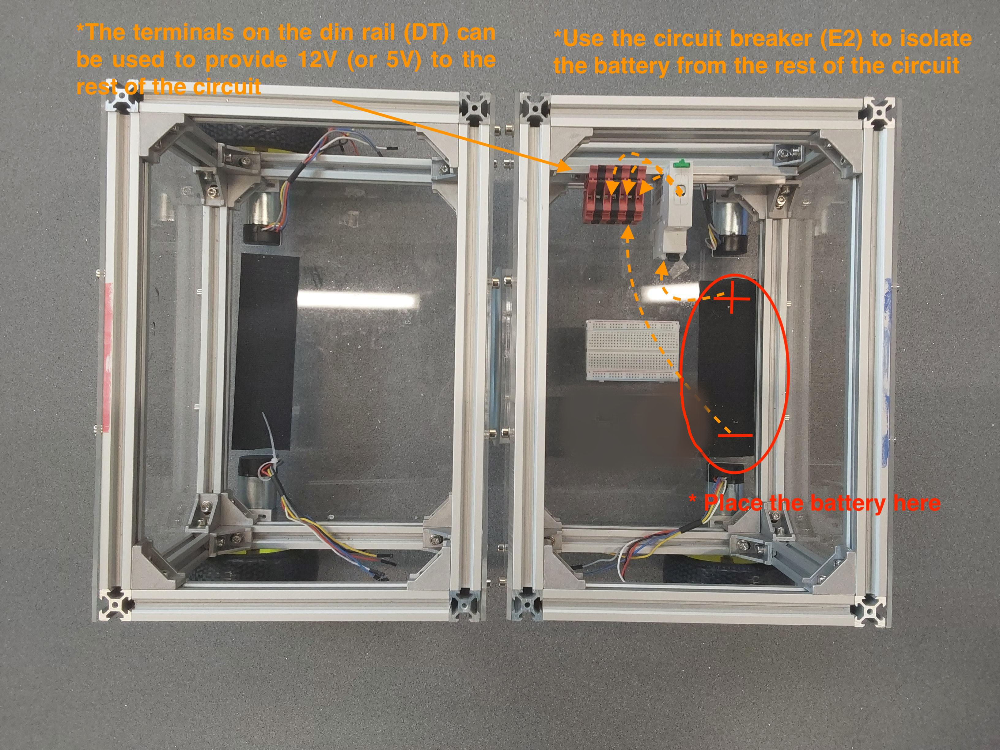
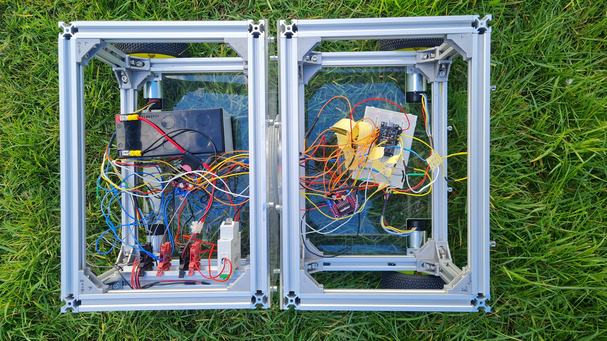

# Electronics layout

## Build time = 75 minutes

### Bill of materials:

| Material                         | Quantity | Reference | UK link |
| ---------------------------------|---------:|:---------:|:-------:|
| 12V Lead Acid battery | 1 | E1 | [Link](https://uk.rs-online.com/web/p/lead-acid-batteries/0597835) |
| 10A circuit breaker | 1 | E2 | [Link](https://amz.run/5TFI) |
| Buck converter | 1 | E3 | [Link](https://amz.run/5TFJ) |
| ESP32 | 1 | E4 | [Link](https://amz.run/9w90) |
| L298N Motor drivers | 2 | E5 | [Link](https://amz.run/5TFN) |
| 90:1 12V motor with encoders | 4 | M1 | [Link](https://amz.run/5TFQ) |
| Din rail with terminal blocks | 1 | DT | [Link](https://amz.run/5TFF) |
| Velcro | 1 | Q | [Link](https://amz.run/9w95) |
| Breadboards | - | - | - |
| Wires | - | - | - |

CQrobot Motor (M1) pinout:
| Motor (M1) | wire |
| -----------|-----:|
| ENC_A  | yellow |
| ENC_B  | white |
| VCC    | blue |
| GND    | gray |
| MOTOR+ | red |
| MOTOR- | black |

## Introduction

This tutorial provides instructions for wiring together the electronic components. Example photos are provided and can be used as reference, however some of the components are optional (e.g. the terminal blocks (DT) on the din rail, and the breadboards) but you are free to replace them with other components such as veroboards, depending on your soldering experience. (**WARNING**: Please handle the Lead Acid battery (E1) with care. DO NOT EVER touch touch the terminals, or any live wires, with your hand.)

## Wiring Diagram

  

## Step-by-step instructions

### 1. Connecting the battery and ESP32

1. Attach a strap of velcro (Q) either on the back or the front of the robot (depending on where you'd like to place the battery), and on the bottom of the battery (E1) so you can secure it on the robot. You can use the terminal blocks on the din rail (DT) to prepare some 12V and 5V (using the step down converter (E3)) power lines to power the components.

  

2. Attach the ESP32 on a breadboard.

### 2. Connect the front and back motors to the motor drivers, keeping the motor driver on the respective side.

  

### 3. Connect the motor drivers and encoders to the ESP32 as in diagram, use din rail to connect 3.3V to motor encoders.

  

## What's next?
Congratulations! The robot wiring is complete. Follow the last part of the tutorial series to [flash the software](../../Software/Controller/README.md).

Page last reviewed by: B.K. on 18/07/25

Notes - I modified this page to fit the new MCU, I think its ok but it may need some extra clarity and ideally these picture should be taken again to make the process more seamless. (or if its hard to follow)
