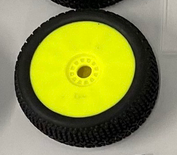
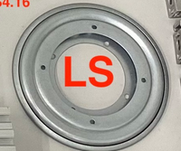
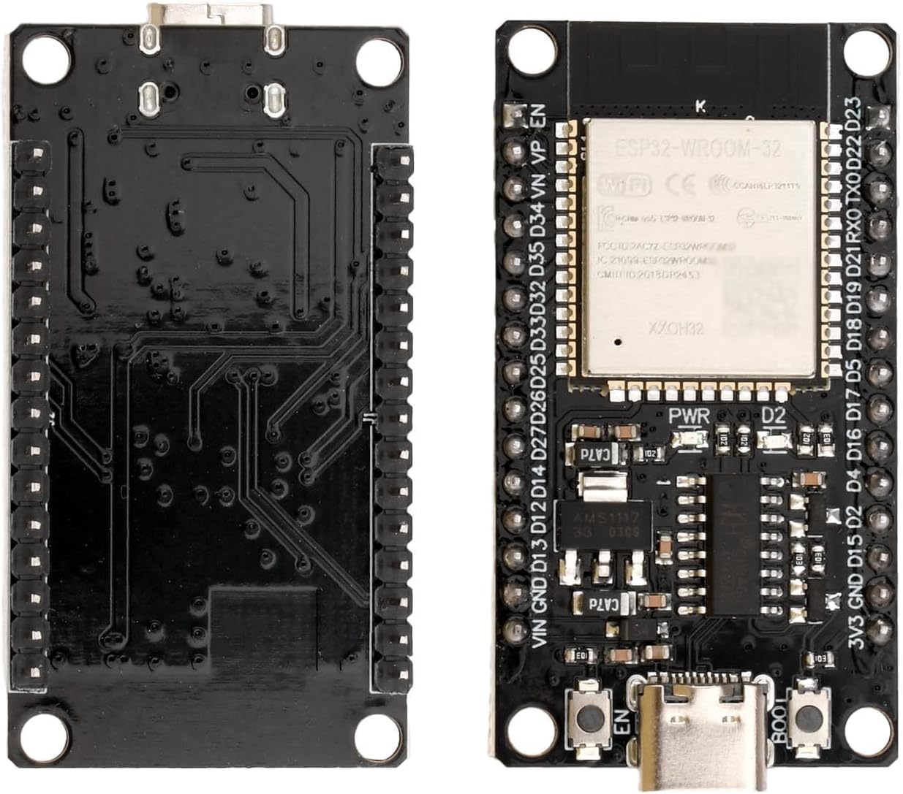

# Wheel

  
  

The wheel, and the parts connecting it to the axel (Hex coupler, Hex Wheel driver) are either produced by third parties or out of production. This is a critical shortage which prevents anyone who doesn't already own these parts from building the OpenScoutV1.1. As such, they have to be replaced. Rather than finding a new commerical part, it is highly recommended to find a design or to design a wheel which can be produced locally with low or little skill. 3D printing comes to mind as it's a good way to make a part which can be reproduced forever, but if a better wheel solution is found so be it. Maybe it's easier to make the wheel out of cut acrylic? Ultimately it comes down to what works in practice and thats hard to predict.

# Hinge

  

The hinge isn't technically out of stock, but it's availablity has been spotty. It seems to be available on aliexpress but western online stores can be hit or miss. This hinge comes in multiple size variants, although 5.5in is used for the OpenScoutV1.1. Occasionally stores will refer to it as a "Lazy Susan". If this particular design does come out of production it should be easy to replace it as there are many similar hinges online, its just that the CAD files for the plastic plates where the hinge meets would need to be redesigned to fit the new screw locations. This would work, but once again it's not a permanent solution. The ideal solution would be reproducible locally forever, admittedly that's difficult with a hinge but maybe there is a solution. 

# ESP32

  

The particular ESP32 which the OpenScoutV1.1 was designed with can be called the "[ESP32-CH340C Type-C](https://amz.run/9w90)", which means that it's a generic ESP32 with a CH340C chip and a Type-C connector. While it has most features in common with a typical ESP32-WROOM-32 this variant is slightly different, for example some of the pin locations are different to the ESP32s produced directly be ESPRESSIF. This wasn't chosen out of any technical reason, other than the fact that a ESP32 was needed quickly and amazon had 1 day shipping as opposed to the month+ wait from aliexpress. With that said this highlights a very important point, buying an ESP32 can be confusing as there is no one "ESP32". ESP32 is a name which covers lots of different chips which work almost the same but have differences which may be hard to find the documention of, especially if they are made by a third party manfacturer. Genuinely, if you happen to have one of these third party ESP32s you are better off finding out which pin does what by comparing it to the core designs, looking at the labels, and trial and error. Ultimately it shouldn't make much of a difference as all these ESP32s generally do almost the same thing, just they might have slightly different dimensions or pin configurations. In the future it may be worth switching the OpenScout design to a ESP32 model actually produced by ESPRESSIF as opposed to the current third party one, especially if its a newer model which is planned for long term production (you can check this on the [ESSPRESSIF website](https://www.espressif.com/en/products/socs/esp32)). I'm not sure what to comment on regarding long term planning as MCUs are almost impossible to produce locally, I suppose this part might be an exception where its acceptable to update it as a OpenScout variant ages, since it shouldn't change the properties aside from better compute.

# 20x20 aluminium extrusion

Lorem ipsum dolor sit amet, consectetur adipiscing elit, sed do eiusmod tempor incididunt ut labore et dolore magna aliqua. Ut enim ad minim veniam, quis nostrud exercitation ullamco laboris nisi ut aliquip ex ea commodo consequat. Duis aute irure dolor in reprehenderit in voluptate velit esse cillum dolore eu fugiat nulla pariatur. Excepteur sint occaecat cupidatat non proident, sunt in culpa qui officia deserunt mollit anim id est laborum.

Page last reviewed by: B.K. on 19/07/25

Notes - I can't do this fully due to practical limitations, but I recommend this page be used to detail what each part is exactly with pictures and blueprints, just in case links to buy them go offline. This could also be a place to store notes about plans of how each part is going to be replaced to increase the ability to build the robot locally.
